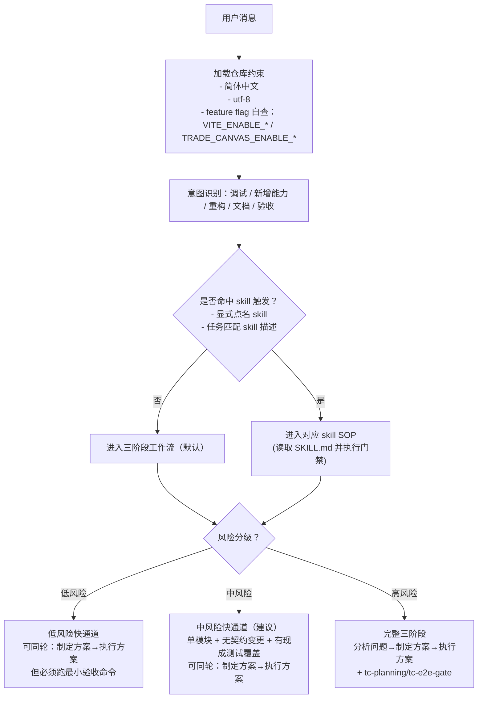
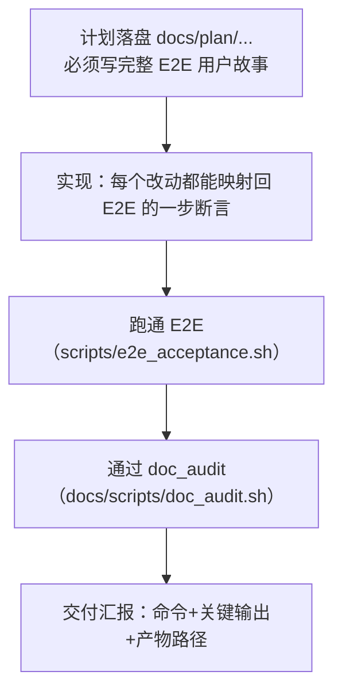

# Agent 工作流（入口 / 门禁 / 证据 / 验收 SOP）

目的：把 trade_canvas 的协作流程收敛为“可执行的门禁链路”，减少 agent/人类在多份文档/脚本之间来回跳转的成本。

本文件是 **工作流真源入口**（与 `AGENTS.md` / `.codex/skills/*` / `scripts/*` 对齐）。

相关真源：
- 协作总约束：`AGENTS.md`
- skills 索引：`docs/core/skills.md`
- 计划模板：`docs/plan/_template.md`（用 `bash docs/scripts/new_plan.sh "title"` 生成）
- 文档状态约定：`docs/core/doc-status.md`
- E2E 门禁：`scripts/e2e_acceptance.sh`
- Worktree 验收门禁：`scripts/worktree_acceptance.sh`

---

## 0) Agent 入口：收到消息后的路由



### 风险分级（对齐 `AGENTS.md`）
- 低风险：docs/test/style/无行为 refactor（不改契约、不改主链路）
- 中风险：单模块/单目录逻辑变更（可能影响行为）
- 高风险：跨模块、契约/Schema/API、核心不变量、影响主链路一致性

### 调试入口（建议）

- 默认入口：`tc-debug`（可复现→定位→根因→最小修复→验证）
- 升级条件：跨模块/多假设/不稳定时，升级到 `systematic-debugging` 流程

### 阶段一的“前置轻量检查”（建议）

目的：在不改代码的前提下，尽早暴露“根本跑不起来”的问题，减少方案讨论空转。

- Python/后端：`pytest -q --collect-only`
- 前端/TS：`cd frontend && npx tsc -b --pretty false --noEmit`

---

## 1) 两档循环：Fast loop vs Delivery loop

### 1.1 Fast loop（本地快速迭代）

目标：快速验证想法/缩短反馈，但不把它当交付证据。

常用手段（按需）：
- 跑 E2E 的 smoke：`E2E_SMOKE=1 bash scripts/e2e_acceptance.sh`
- 临时跳过文档审计（仅本地）：`E2E_SKIP_DOC_AUDIT=1 bash scripts/e2e_acceptance.sh`

约束：
- 不允许以 Fast loop 结果宣称“已交付/已完成”。

### 1.2 Delivery loop（交付门禁）

目标：形成唯一可复核证据链。

必须满足：
- E2E：`bash scripts/e2e_acceptance.sh`（退出码 0）
- 文档审计：`bash docs/scripts/doc_audit.sh`（退出码 0）
- 证据产物：`output/playwright/` 与运行日志（失败时必须有 trace/screenshot）

---

## 2) 中/高风险的主链路：计划 → E2E 用户故事 → 实现 → 证据



硬规则：
- 中/高风险：必须有 `docs/plan/...`（且包含完整 E2E 用户故事与具体数值场景）。
- 文档必须有状态（草稿/开发中/已上线），并在门禁中被检查/推进（见 §4）。

---

## 3) 提交策略（与 `AGENTS.md` 对齐）

- Atomic Commits：1 commit = 1 意图，可独立回滚
- Conventional Commits：`feat/fix/refactor/docs/test(scope): <why>`

---

## 4) 项目管理链路：计划与文档状态门禁

### 4.1 状态枚举（对齐 `docs/core/doc-status.md`）

- 草稿：`draft` / `草稿`
- 开发中：`in_progress` / `开发中`
- 已上线：`online` / `已上线`（与 `done/已完成` 等价；用于“可交付/可宣称完成”）

### 4.2 门禁：验收时必须推进计划状态

推荐做法：在 worktree 验收脚本中自动推进状态并形成原子提交（见 §5）。

---

## 5) Worktree 验收 SOP（当你说“验收”）

目标：review 无误、无冲突 → 合并 main → 删除 worktree → 更新计划文档状态（已上线）并留下证据。

### 5.1 Dry-run（只看 review + 门禁预检查）

```bash
bash scripts/worktree_acceptance.sh
```

### 5.2 真执行（一键收尾：推进 plan 状态 + doc_audit + merge + remove）

```bash
# 推荐：脚本会自动从 .worktree-meta/<id>.json 读取 plan_path（中/高风险必填）
bash scripts/worktree_acceptance.sh --yes --push --auto-doc-status --run-doc-audit

# 若 metadata 没有 plan_path，可显式指定：
bash scripts/worktree_acceptance.sh --yes --push --auto-doc-status --run-doc-audit --plan-doc docs/plan/2026-02-05-xxx.md
```

约束：
- 默认禁止在 main worktree 执行。
- 默认要求 feature/main worktree 都 clean。
