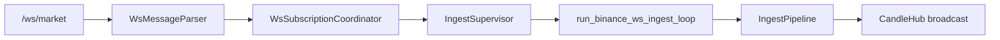
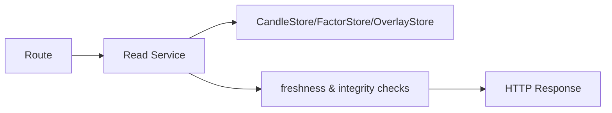

# trade_canvas 架构总览

本文是当前代码实现口径下的后端架构总览，强调三件事：
- 职责边界是否清晰；
- 主链路是否单路径、可追踪；
- 扩展是否靠插件与契约，而不是散落改动。

补充阅读：`docs/core/backend-chain-breakdown.md`

---

## 1. 设计原则（当前版本）

1. `closed candle` 是唯一权威输入，驱动 factor/overlay/strategy。
2. `forming candle` 只用于图表展示，不落库、不进因子、不进策略。
3. 写链路单路径：`candles -> factor -> overlay`，统一由 `IngestPipeline` 执行。
4. 读链路读写分离：HTTP/WS 路由只做协议与参数，业务在 service/orchestrator。
5. 运行时配置单真源：`FeatureFlags + RuntimeFlags`，由容器启动时注入。

---

## 2. 系统分层

### 2.1 应用装配层（Bootstrap）

- 入口：`backend/app/main.py`
- 容器：`backend/app/container.py`
- 市场运行时装配：`backend/app/market_runtime_builder.py`

职责：
- 初始化 `AppContainer`（store、orchestrator、service、runtime）。
- 注册路由与 websocket 入口。
- 管理生命周期（白名单 ingest、ondemand reaper、hub/supervisor 关闭）。
- 可选执行启动巡检补齐（`enable_startup_kline_sync`）。

### 2.2 配置层（Config/Flags）

- 基础配置：`backend/app/config.py` (`Settings`)
- 稳态功能开关：`backend/app/flags.py` (`FeatureFlags`)
- 运行时参数与高风险开关：`backend/app/runtime_flags.py` (`RuntimeFlags`)

职责：
- 统一读取 env。
- 在启动阶段一次性解析。
- 通过依赖注入传入 service/orchestrator，避免运行期散读 env。

### 2.3 主链路层（Domain Runtime）

- 市场写入编排：`backend/app/pipelines/ingest_pipeline.py`
- 因子编排：`backend/app/factor_orchestrator.py`
- 绘图编排：`backend/app/overlay_orchestrator.py`
- 绘图读写拆分：`backend/app/overlay_ingest_reader.py` + `backend/app/overlay_ingest_writer.py`
- 绘图编排支持 reader/writer 依赖注入（便于测试与替换实现）。
- 市场实时监督：`backend/app/ingest_supervisor.py`
- 市场应用服务：`backend/app/market_ingest_service.py`

职责：
- 保证写顺序一致。
- 处理 backfill/ondemand/ws ingest 的统一下游语义。
- 通过 `TRADE_CANVAS_ENABLE_INGEST_COMPENSATE_OVERLAY_ERROR` 与 `TRADE_CANVAS_ENABLE_INGEST_COMPENSATE_NEW_CANDLES` 提供失败补偿 kill-switch（默认关闭）。
- 输出可观测事件（debug hub + ws 广播）。

### 2.4 读模型层（Read Models）

- `backend/app/read_models/factor_read_service.py`
- `backend/app/read_models/draw_read_service.py`
- `backend/app/read_models/world_read_service.py`

职责：
- 按 `aligned_time + candle_id` 对齐输出。
- 读链路默认不做隐式修复；发现账本不一致直接返回 `409 ledger_out_of_sync*`。
- world 聚合 factor + draw，保证同一时间面快照一致。
- 读模型层统一抛 `ServiceError`，由 route 层映射 `HTTPException`，避免读模型与 FastAPI 框架耦合。

### 2.5 外部适配层（Adapters）

- backtest：`backend/app/backtest_service.py`
- freqtrade 映射：`backend/app/freqtrade_adapter_v1.py`
- replay 打包：`backend/app/replay_package_service_v1.py`

职责：
- 把内部 ledger / draw / candles 映射到外部协议。
- 保持 fail-safe（数据不足、对齐失败、模式不合法时显式报错）。

---

## 3. 后端主链路

### 3.1 写链路（HTTP/WS/回放共用）


关键点：
- `IngestPipeline` 是唯一写链路编排器。
- Sidecar 顺序固定，避免“图画出来但因子没更新”或反之。
- overlay 可选补偿重建（`enable_ingest_compensate_overlay_error`）。

### 3.2 实时链路（WS）



关键点：
- subscribe/unsubscribe 统一走 coordinator。
- ondemand/whitelist 生命周期统一走 supervisor。
- derived timeframe 订阅映射到 base timeframe 管理。

### 3.3 读链路（factor/draw/world）



关键点：
- 因子读取先对齐 `aligned_time`。
- draw 在 cursor=0 做完整性校验（插件化 integrity checks）。
- world 要求 `factor.candle_id == draw.to_candle_id`，否则 409。

---

## 4. 扩展策略

### 4.1 新增因子

优先修改：
- `backend/app/factor_processor_*.py`
- `backend/app/factor_slice_plugins.py`
- `backend/app/factor_default_components.py`
- 对应契约：`docs/core/contracts/factor_*.md`

原则：
- 算法写入与切片读取都走插件注册。
- 不在 orchestrator 继续堆 if/else 分支。

### 4.2 新增市场数据能力

优先修改：
- `backend/app/market_data/`
- `backend/app/market_runtime_builder.py`
- `backend/app/runtime_flags.py`

原则：
- 新能力必须由 `TRADE_CANVAS_ENABLE_*` 开关控制（默认关闭）。
- 路由层不直接拼装复杂逻辑，统一下沉应用服务。
- 市场 meta 路由按职责拆分（health/debug/top_markets），避免单文件膨胀。

### 4.3 新增回测/适配能力

优先修改：
- `backend/app/backtest_service.py`
- `backend/app/freqtrade_adapter_v1.py`
- `backend/app/freqtrade_signal_plugins.py`

原则：
- 对外接口保持稳定。
- 输入校验与 fail-safe 在 service 层显式实现。

---

## 5. 质量门禁

后端架构类改动最小门禁：

```bash
pytest -q
```

涉及 `docs/core/` 变更时附加：

```bash
bash docs/scripts/doc_audit.sh
```

涉及 FE+BE 主链路联动时附加：

```bash
bash scripts/e2e_acceptance.sh
```

---

## 6. 当前已下线/不再推荐口径

- 不再使用 `market_flags.py` 作为市场链路配置真源（已收口到 `FeatureFlags + RuntimeFlags`）。
- 不再在路由实现中直接读取散落 `app.state.*` 字段（统一通过 `dependencies.py` 获取容器依赖）。
- 不再保留“写路径多套实现”的灰度分支（统一走 `IngestPipeline`）。
- 不再允许 draw/factor 读接口在请求内触发隐式 overlay repair；需走显式 repair 入口（受 `TRADE_CANVAS_ENABLE_READ_REPAIR_API` 控制）。
