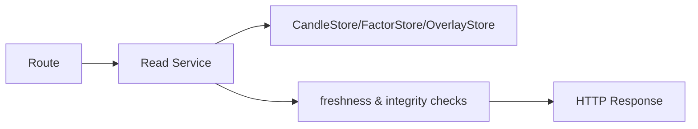

# trade_canvas 架构总览

本文是当前代码实现口径下的后端架构总览，强调三件事：
- 职责边界是否清晰；
- 主链路是否单路径、可追踪；
- 扩展是否靠插件与契约，而不是散落改动。

补充阅读：`docs/core/backend-chain-breakdown.md`

---

## 0. 架构硬约束（先看）

- 单向数据流：`ingest -> store -> factor -> overlay -> read_model -> route`
- `closed candle` 是唯一权威输入；`forming` 只用于展示
- 读链路固定 strict：只读不写，不做隐式 repair，不做隐式重算
- 运行时开关单真源：`backend/app/runtime/flags.py`（默认关闭高风险能力）

---

## 1. 设计原则（当前版本）

1. `closed candle` 是唯一权威输入，驱动 factor/overlay/strategy。
2. `forming candle` 只用于图表展示，不落库、不进因子、不进策略。
3. 写链路单路径：`candles -> factor -> overlay`，统一由 `IngestPipeline` 执行。
4. 读链路读写分离：HTTP/WS 路由只做协议与参数，业务在 service/orchestrator。
5. 运行时配置单真源：`RuntimeFlags`，由容器启动时注入；基础 env 解析工具集中在 `backend/app/core/flags.py`。

---

## 2. 系统分层

### 2.1 应用装配层（Bootstrap）

- 入口：`backend/app/main.py`
- 容器：`backend/app/bootstrap/container.py`
- 市场运行时装配：`backend/app/market/runtime_builder.py`
- 生命周期编排：`backend/app/lifecycle/service.py`

职责：
- 初始化 `AppContainer`（store、orchestrator、service、runtime）。
- 注册路由与 websocket 入口。
- 通过 `AppLifecycleService` 管理生命周期（白名单 ingest、ondemand reaper、hub/supervisor 关闭）。
- 可选执行启动巡检补齐（`enable_startup_kline_sync`）。

### 2.2 配置层（Config/Flags）

- 基础配置：`backend/app/core/config.py` (`Settings`)
- env 解析工具：`backend/app/core/flags.py`
- 功能开关与运行时参数：`backend/app/runtime/flags.py` (`RuntimeFlags`)

职责：
- 统一读取 env。
- 在启动阶段一次性解析。
- 通过依赖注入传入 service/orchestrator，避免运行期散读 env。
- 高风险能力必须有 `TRADE_CANVAS_ENABLE_*` kill-switch（默认关闭）。
- 详细参数与默认值以 `backend/app/runtime/flags.py` 为真源；专题说明分别见 `docs/core/market-kline-sync.md` 与 `docs/core/backtest.md`。
- SQLite store 统一使用 schema migrations 初始化，无 legacy `CREATE TABLE IF NOT EXISTS` 兼容分支。

### 2.3 主链路层（Domain Runtime）

- 市场写入编排：`backend/app/pipelines/ingest_pipeline.py`
- 因子编排：`backend/app/factor/orchestrator.py`
- 绘图编排：`backend/app/overlay/orchestrator.py`
- 绘图读写拆分：`backend/app/overlay/ingest_reader.py` + `backend/app/overlay/ingest_writer.py`
- 绘图编排支持 reader/writer 依赖注入（便于测试与替换实现）。
- 市场实时监督：`backend/app/ingest/supervisor.py`
- 市场应用服务：`backend/app/market/ingest_service.py`
- 市场运行时上下文：`MarketReadContext` / `MarketIngestContext` / `MarketRealtimeContext`

职责：
- 保证写顺序一致。
- 处理 backfill/ondemand/ws ingest 的统一下游语义。
- 通过 `TRADE_CANVAS_ENABLE_INGEST_COMPENSATE_OVERLAY_ERROR` 与 `TRADE_CANVAS_ENABLE_INGEST_COMPENSATE_NEW_CANDLES` 提供失败补偿 kill-switch（默认关闭）。
- Binance WS 发布统一收口 `IngestPipeline.publish_ws`（best-effort 单路径），无主/次 series 双策略兼容层。
- 输出可观测事件（debug hub + ws 广播）。
- `MarketRuntime` 仅作为上下文聚合根，对外优先注入细粒度上下文依赖，避免路由/入口直接消费大对象字段。

### 2.4 读模型层（Read Models）

- `backend/app/read_models/factor_read_service.py`
- `backend/app/read_models/draw_read_service.py`
- `backend/app/read_models/world_read_service.py`

职责：
- 按 `aligned_time + candle_id` 对齐输出。
- factor 读链路固定 strict：只读不写，不触发隐式重算。
- 读链路默认不做隐式修复；发现账本不一致直接返回 `409 ledger_out_of_sync*`。
- world 聚合 factor + draw，保证同一时间面快照一致。
- 读模型层统一抛 `ServiceError`，由 route 层映射 `HTTPException`，避免读模型与 FastAPI 框架耦合。

### 2.5 外部适配层（Adapters）

- backtest：`backend/app/backtest/service.py`
- freqtrade 映射：`backend/app/freqtrade/adapter_v1.py`
- replay 打包：`backend/app/replay/package_service_v1.py`

职责：
- 把内部 ledger / draw / candles 映射到外部协议。
- 保持 fail-safe（数据不足、对齐失败、模式不合法时显式报错）。

---

## 3. 后端主链路

本节只描述骨架；函数级时序与故障定位入口见 `docs/core/backend-chain-breakdown.md`。

### 3.1 写链路（HTTP/WS/回放共用）


关键点：
- `IngestPipeline` 是唯一写链路编排器。
- Sidecar 顺序固定，避免“图画出来但因子没更新”或反之。
- overlay 可选补偿重建（`enable_ingest_compensate_overlay_error`）。

### 3.2 实时链路（WS）


关键点：
- subscribe/unsubscribe 统一走 coordinator。
- ondemand/whitelist 生命周期统一走 supervisor。
- derived timeframe 订阅映射到 base timeframe 管理。
- WS flush 的 candle/system 广播固定走 pipeline 统一发布（best-effort）。
- 开启 `TRADE_CANVAS_ENABLE_RUNTIME_METRICS=1` 后，WS 订阅链路会额外上报 `market_ws_subscribe_total`、`market_ws_unsubscribe_total`、`market_ws_active_subscriptions` 等进程内指标，可通过 `/api/market/debug/metrics` 观测。

### 3.3 读链路（factor/draw/world）



关键点：
- 因子读取先对齐 `aligned_time`。
- draw 在 cursor=0 做完整性校验（插件化 integrity checks）。
- world 要求 `factor.candle_id == draw.to_candle_id`，否则 409。

---

## 4. 扩展策略

### 4.1 新增因子

优先修改：
- `backend/app/factor/processor_*.py`
- `backend/app/factor/slice_plugins.py`
- `backend/app/factor/default_components.py`
- 对应契约：`docs/core/contracts/factor_*.md`

原则：
- 算法写入与切片读取都走插件注册。
- 不在 orchestrator 继续堆 if/else 分支。

### 4.2 新增市场数据能力

优先修改：
- `backend/app/market_data/`
- `backend/app/market/runtime_builder.py`
- `backend/app/runtime/flags.py`

原则：
- 新能力必须由 `TRADE_CANVAS_ENABLE_*` 开关控制（默认关闭）。
- 路由层不直接拼装复杂逻辑，统一下沉应用服务。
- 市场 meta 路由按职责拆分（health/debug/top_markets），避免单文件膨胀。

### 4.3 新增回测/适配能力

优先修改：
- `backend/app/backtest/service.py`
- `backend/app/freqtrade/adapter_v1.py`
- `backend/app/freqtrade/signal_plugins.py`

原则：
- 对外接口保持稳定。
- 输入校验与 fail-safe 在 service 层显式实现。

---

## 5. 质量门禁与文档自检

后端架构类改动最小门禁：

```bash
pytest -q --collect-only
```

```bash
pytest -q
```

涉及 `docs/core/` 变更时附加：

```bash
bash docs/scripts/doc_audit.sh
```

涉及 FE+BE 主链路联动时附加：

```bash
bash scripts/e2e_acceptance.sh
```

---

## 6. 文档边界（防漂移）

- 本文只维护“边界 + 不变量 + 扩展策略”，不承载函数级细节。
- 调用顺序、关键函数入口、排障路径统一维护在 `docs/core/backend-chain-breakdown.md`。
- 数据结构与接口语义统一维护在 `docs/core/contracts/` 与 `docs/core/api/v1/`。
- 真源映射统一维护在 `docs/core/source-of-truth.md`。

---

## 7. 当前已下线/不再推荐口径

- 不再使用 `market_flags.py` 作为市场链路配置真源（已收口到 `RuntimeFlags`）。
- 不再在路由实现中直接读取散落 `app.state.*` 字段（统一通过 `backend/app/deps/` 获取容器依赖）。
- 不再保留“写路径多套实现”的灰度分支（统一走 `IngestPipeline`）。
- 不再允许 draw/factor 读接口在请求内触发隐式 overlay repair；需走显式 repair 入口（受 `TRADE_CANVAS_ENABLE_READ_REPAIR_API` 控制）。
