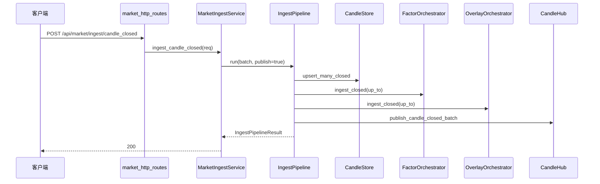

# 后端链路拆解（启动 / 写入 / 读取 / 回放）

本文是 `backend/app/` 的代码级拆解，目标是让架构评审与故障定位都能快速落到具体文件。

---

## 1. 启动装配链路

### 1.1 入口顺序

1. `backend/app/main.py:create_app()`
2. `backend/app/container.py:build_app_container()`
3. `backend/app/market_runtime_builder.py:build_market_runtime()`

关键装配产物：
- `AppContainer`：全局依赖聚合（store/orchestrator/service/runtime）。
- `MarketRuntime`：市场 HTTP/WS 所需的统一运行时对象。
- `IngestPipeline`：写链路唯一编排器。

### 1.2 生命周期

- 启动时：
  - 可选执行 startup kline sync（whitelist 巡检补齐 + ingest sidecar refresh）。
  - 可选开启 whitelist ingest。
  - 可选开启 ondemand reaper。
- 退出时：
  - 关闭 WS hub。
  - 关闭 ingest supervisor。

---

## 2. 配置真源链路

### 2.1 两层配置模型

- `FeatureFlags`（`backend/app/flags.py`）
  - 偏“功能开关与治理阈值”（如 strict/read、whitelist、ondemand）。
- `RuntimeFlags`（`backend/app/runtime_flags.py`）
  - 偏“运行时参数与高风险开关”（factor/replay/derived/ws 批次等）。

### 2.2 注入原则

- 启动时集中读取 env。
- 服务层尽量不再直接读 env。
- 路由层通过 `dependencies.py` 从容器拿依赖，不散落访问 `app.state`。

---

## 3. 写链路（closed candle）

入口：`POST /api/market/ingest/candle_closed`

写链路不变量：
- 先 candles，后 factor，再 overlay。
- sidecar 失败必须带 step 语义（`IngestPipelineError`）。
- forming 不进入该链路。
- overlay ingest 内部读写职责拆分：窗口读取/归桶在 `overlay_ingest_reader.py`，落库去重在 `overlay_ingest_writer.py`。
- overlay orchestrator 允许注入 reader/writer 实现，编排层测试无需依赖真实存储。

---

## 4. 实时链路（WS + 订阅作业）

### 4.1 WS 消息处理

- 入口：`/ws/market`
- 处理：`market_ws_routes.handle_market_ws`
- 消息解析：`WsMessageParser`
- 订阅协同：`WsSubscriptionCoordinator`

### 4.2 作业监督

- `IngestSupervisor` 负责：
  - whitelist 常驻任务
  - ondemand 订阅任务
  - refcount / idle TTL / max jobs

### 4.3 Binance ingest loop

- `ingest_binance_ws.run_binance_ws_ingest_loop`
- 行为：
  - 读取上游 kline
  - forming 节流广播（仅展示）
  - closed batch flush -> `IngestPipeline`

关键参数（`RuntimeFlags`）：
- `binance_ws_batch_max`
- `binance_ws_flush_s`
- `market_forming_min_interval_ms`
- `enable_ingest_ws_pipeline_publish`（env: `TRADE_CANVAS_ENABLE_INGEST_WS_PIPELINE_PUBLISH`，默认 `0`）

发布语义：
- 默认（`0`）：`IngestPipeline.publish_ws` 走 legacy 兼容策略（primary strict + secondary/system best-effort）。
- 灰度（`1`）：`IngestPipeline.publish_ws` 切到 unified 策略（`publish(best_effort=True)`）。
- WS 入口（`ingest_binance_ws.py`）不再手工拼装 `hub.publish_*`，发布职责统一收口到 pipeline。

---

## 5. 读链路（factor / draw / world）

### 5.1 factor

- 路由：`/api/factor/slices`
- 服务：`FactorReadService`
- 关键点：对齐 `aligned_time`；默认 strict（`TRADE_CANVAS_ENABLE_READ_STRICT_MODE=1`）。
- 非 strict 默认不隐式重算；仅在 `TRADE_CANVAS_ENABLE_READ_IMPLICIT_RECOMPUTE=1` 时允许兼容性重算。

### 5.2 draw

- 路由：`/api/draw/delta`
- 服务：`DrawReadService`
- 关键点：
  - cursor=0 首帧做 overlay integrity checks。
  - 发现 overlay 不一致直接 `409 ledger_out_of_sync:overlay`，不在读请求内隐式重建。
  - 显式修复走 `/api/dev/repair/overlay`（受 `TRADE_CANVAS_ENABLE_READ_REPAIR_API` 控制，默认关闭）。

### 5.3 world

- 路由：
  - `/api/frame/live`
  - `/api/frame/at_time`
  - `/api/delta/poll`
- 服务：`WorldReadService`
- 关键点：
  - 强制 `factor.candle_id == draw.to_candle_id`
  - 不一致返回 `ledger_out_of_sync`

---

## 6. replay 链路

### 6.1 prepare

- 接口：`POST /api/replay/prepare`
- 服务：`ReplayPrepareService`
- 语义：把 factor/overlay 刷到对齐时间，返回 `aligned_time`。

### 6.2 package

- 接口：`/api/replay/*`
- 服务：`ReplayPackageServiceV1`
- 语义：
  - read_only/build/status/window
  - 可选 ensure coverage
  - 可选 ccxt/freqtrade 历史补齐

### 6.3 overlay package

- 路由：`backend/app/overlay_package_routes.py`
- 服务：`OverlayReplayPackageServiceV1`

---

## 7. backtest 与 freqtrade 适配

- 路由：`backend/app/backtest_routes.py`
- 服务：`backend/app/backtest_service.py`
- 适配：`backend/app/freqtrade_adapter_v1.py`

链路职责：
- 策略列表、pair/timeframe 可用性检查。
- 触发回测并返回 stdout/stderr。
- 把 factor ledger 映射成 `tc_*` 信号列供策略使用。

---

## 8. 快速定位顺序（排障）

1. 找入口 route（`*_routes.py`）
2. 看 service（业务编排）
3. 看 orchestrator/pipeline（主链路）
4. 看 store（状态落盘）
5. 看 flags（配置是否偏差）

市场 meta 路由拆分后的定位入口：
- 健康：`backend/app/market_health_routes.py`
- 调试：`backend/app/market_debug_routes.py`
- 榜单/SSE：`backend/app/market_top_markets_routes.py`

---

## 9. 常见过期认知（已废弃）

- “市场链路配置真源是 `market_flags.py`”：已废弃。
- “路由可以直接读散落 app.state 字段”：已收口为容器依赖注入。
- “写链路有多套入口可并存”：当前统一收敛到 `IngestPipeline`。
